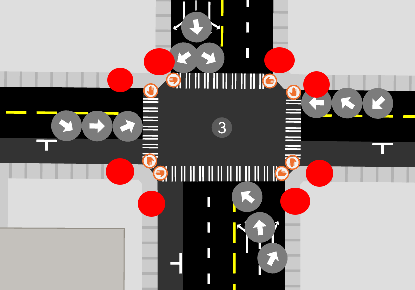
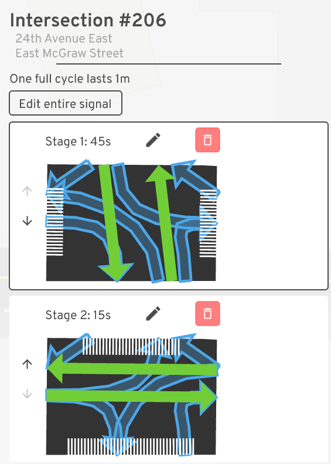
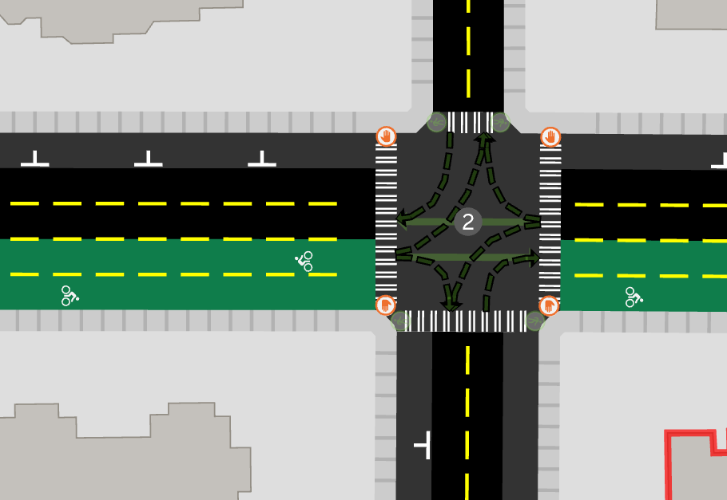
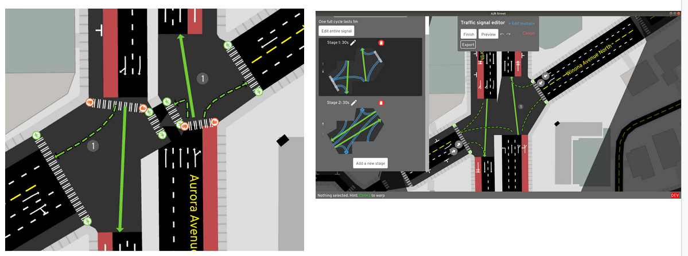

# Traffic signal data format

A/B Street uses a JSON format to describe how a single intersection with traffic
signals is configured. This format changes more frequently, but the software
will automatically upgrade a signal described in an old format. This way,
players can save their edits to a map and, months later, still use the same
edits with a new version of A/B Street. (The only exception is when
OpenStreetMap IDs change; if a way near the intersection is split and assigned a
new ID, we make no attempt to handle this.)

The format is complicated, so let's break down some of the concepts used in it.

## Turns

We first need a way to describe a movement between two road segments. Let's use
<https://www.openstreetmap.org/node/53219808>, the intersection of 24th Ave E
and E McGraw St in Seattle as an example.

### Directed road segments

So first let's identify a single road segment. For this example, let's describe
the eastbound direction of the west side of McGraw St, which is
<https://www.openstreetmap.org/way/804788512> in OSM. As you can see, this way
hits 3 intersections. We just want to describe the segment between 24th and 25th
Ave. Looking at the list of nodes for that way in the order defined in OSM, we
see it goes from <https://www.openstreetmap.org/node/53219808> to
<https://www.openstreetmap.org/node/1709143541>. Note that the intermediate
nodes used as control points for the shape of the road or as crosswalk nodes are
ignored. So, we can describe this segment by using the way's ID and the first
and last node ID.


```
{
  "osm_way_id": 804788512,
  "osm_node1": 53219808,
  "osm_node2": 1709143541,
  "is_forwards": false
}
```

Finally, we have to say which direction of this road segment we're talking
about. The order of the nodes in OSM is arbitrary; in this case, the road points
from the traffic signal we're talking about to another intersection. But we want
to refer to the inbound / eastbound direction of this road. So we say
`"is_forwards": false` to indicate the opposite of the direction specified by
OSM. This is the same concept as "forward & backward" as defined in the
[OSM wiki](https://wiki.openstreetmap.org/wiki/Forward_%26_backward,_left_%26_right).

### Turns for vehicles

So now let's describe the left turn from E McGraw to 24th going southbound. It
looks like this:

```
{
  "from": {
    "osm_way_id": 804788512,
    "osm_node1": 53219808,
    "osm_node2": 1709143541,
    "is_forwards": false
  },
  "to": {
    "osm_way_id": 6470476,
    "osm_node1": 53128048,
    "osm_node2": 53219808,
    "is_forwards": false
  },
  "intersection_osm_node_id": 53219808,
  "is_crosswalk": false
}
```

You specify the `from` and `to` fields using the directed road segment ID.
Additionally, you specify which intersection the traffic signal is at --
`53219808` in this case -- and set `is_crosswalk` to `false` to indicate a turn
for vehicles or cyclists on the road.

### Crosswalks

Why is the format above so repetitive? The reason is to be able to also specify
movements along crosswalks in the intersection. The `from` and `to` directed
road segments refer to one half of a road, so they can be used to identify one
sidewalk or another. From this diagram, you can see how there are 8 different
start or end points for crosswalks at this intersection:



TODO: Walk through an example of a single crosswalk. I hope the explanation of
the format above suffices, for now.

## Stages

Now that we understand how to describe turns, we can describe the sequence of
stages that a traffic signal cycles through. Each stage specifies the turns that
are **protected** and **permitted**. Protected turns have priority (a green
light), and no two protected turns in the same stage can cross each other.
Permitted turns are allowed only if there's no oncoming traffic -- so this could
mean a right turn on red or an unprotected left turn with a flashing arrow. Note
that crosswalks always must be defined as protected, which means any vehicle
turns that intersect with the crosswalk have to be specified as permitted. This
captures the semantics in the US that turning vehicles must always yield to
pedestrians when the crosswalk signal is on.

A single traffic signal cycles through the same list of stages over and over.
Each stage also specifies its duration with the `stage_type`. The simple example
is `"Fixed": 45`, meaning this stage always lasts exactly 45 seconds. A stage
can also have variable timing, also known as actuation. The format is
`"Variable": [15, 2, 10]`. This stage would last a minimum of 15 seconds, but it
may last an additional 10 seconds, up to a maximum of 25 seconds. If there are
no vehicles or pedestrians trying to make protected turns after 15 seconds, the
stage ends. If there are, then the stage is extended by 2 seconds, and the same
check repeats, until the maximum of 25 is reached.

## The full example

Understanding everything above means you should be able to interpret what
<https://github.com/a-b-street/abstreet/blob/599c7b6d6bc078312e5ea9f57d3391be9568ef83/traffic_signal_data/data/53219808.json>
means. The rendering in A/B Street looks like this:



There are two stages. The first lasts 45 seconds and allows north/south
movement. Left turns onto McGraw are permitted after yielding. Since the
north/south crosswalks are also enabled, all right turns also have to yield. The
second stage lasts only 15 seconds and lets east/west traffic move. Left turns
are also unprotected here.

## Limitations

In reality, many traffic signals use different configuration during rush hour,
late at night, on weekends, etc. There's some
[planned work](https://github.com/a-b-street/abstreet/issues/447) to model one
intersection having different plans.

Many intersections in Seattle now use
[leading pedestrian intervals](https://nacto.org/publication/urban-street-design-guide/intersection-design-elements/traffic-signals/leading-pedestrian-interval/),
which enable a crosswalk signal to give pedestrians a head-start into the
intersection before vehicles start to turn. You can model this in A/B Street by
adding an extra stage that only enables the crosswalks and lasts a few seconds,
followed by a stage allowing both the crosswalks and vehicle turns. We could
explicitly add a parameter for LPI duration, but it would complicate the format,
so this "flattened stage" format will work for now.

You'll notice the format for specifying turns works at the granularity of the
entire road, not individual lanes. Most of the time, this is fine -- vehicles
will only use the turn lanes available. But in some cases, we may want to
distinguish two groups of vehicles moving the same direction by the lane type.
In particular, sometimes there's a bidirectional protected cycle-track on one
side of the road with its own dedicated signal:



A/B Street can't model this as having a separate signal yet.

## Complications with importing other data

External software like
[vol2timing](https://github.com/asu-trans-ai-lab/data2timing) can provide much
better signal configuration than A/B Street's default heuristics. We will
encounter at least two major challenges to import it.

## Crosswalks

A/B Street currently does not use sidewalks, foot-paths, and crosswalks that are
explicitly drawn as separate OSM ways. Instead, it makes many guesses for which
roads have a sidewalk and creates many, many crosswalks. See
<https://github.com/a-b-street/abstreet/issues/485> for some examples of
crosswalks that should not be created, but currently are.

When A/B Street imports traffic signal configuration, it validates that all
possible turns at the intersection are captured by at least one stage. The
problem here will be that other software may not list as many crosswalks as A/B
Street expects.

## Intersection merging/consolidation

OSM models bidirectional roads with some physical median as two one-ways. When
these divided one-ways cross a regular road, the intersection is split into two
intersections with a very short "road" in between. When two pairs of divided
one-ways cross, the intersection has four nodes and short "roads" in between.
This wreaks havoc in A/B Street, making the intersection geometry look strange,
making it hard to edit the two or four uncoordinated traffic signals around the
intersection, and causing vehicles to get stuck in the short "roads".

One solution that's promising is for A/B Street to consolidate those nodes and
short "roads" into one big intersection, capturing how a human would intuitively
view the area. One case where this works well is
<https://www.openstreetmap.org/#map=19/47.68264/-122.34426>. See the before and
after:



Unfortunately this process doesn't work for many more cases, so it's not enabled
by default yet. Preserving turn restrictions defined by OSM and getting good
results for the geometry of the consolidated intersection is hard.

In the meantime, all of this complicates the traffic signal format, because it's
unclear how to specify road segments when A/B Street will arbitrarily delete
some of the node IDs when it imports.
