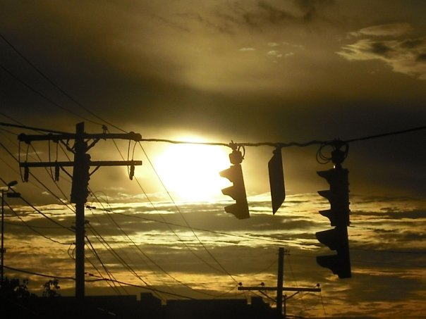
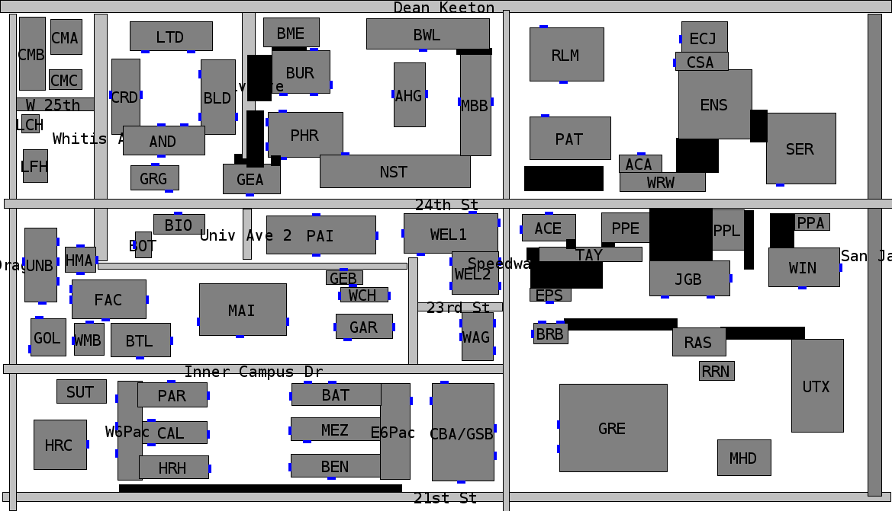

# Backstory

I originally wanted to tell a much longer story here of how I came to work on
A/B Street, but I'm not sure this is the right time yet. So consider this the
quick version.

I grew up in Baton Rouge, where driving is effectively the only mode of
transport. (I've gone back and made a point of taking long walks to confirm how
antagonistically the city is designed towards walking.) Very early on, I fell in
love with a Nintendo 64 game called Banjo Kazooie, which led me to the online
fan communities of the early 2000's. I wanted to create games too, so I started
learning programming via library books and lots of questions on IRC. Because I
never had any confidence in art, I wound up working on
[roguelikes](https://github.com/dabreegster/mnemonicrl/), which led to a fervent
interest in pathfinding algorithms and
[collaborative diffusion](http://www.cs.colorado.edu/~ralex/papers/PDF/OOPSLA06antiobjects.pdf).
When I started driving in high school, I quickly realized how bad people were at
it. I remember being stuck at the intersection of
[Florida Blvd and Cloud](https://www.openstreetmap.org/node/1279204989) and
first wondering if the pathfinding algorithms could help with traffic. Can you
see where this is going?

I moved to Austin for college. One of the first days of class, I shuffled down
the stairs of Gearing Hall past a crackly old speaker apocalyptically announcing
the weather forecast (details add color, right?) into a seminar demanding a
totally open-ended first assignment to do something interesting. After I left,
somebody stopped to ask me for directions, but I didn't know campus well yet. I
thought about how Google Maps gave really silly walking directions. So I decided
I'd hand-draw a map of campus, showing all of the construction, how to cut
through the labryinth that is Welch Hall on hot days, and where to find the 24/7
robot coffee machines, and hack together a routing engine to help people find
the shortest path between their classes. The feedback I got on this assignment
included something along the lines of, "I was really pretty impressed first that
you would be so stupid as to actually try to do this..."

But I did, and that led me to discovering OpenStreetMap, which it turns out was
pretty pivotal. (The first version of my campus map was seeded vaguely off an
official paper map, but mostly I walked around and invented half-assed surveying
methods on the spot.) Next semester, I joined a freshman research stream with
somebody who had worked on [AIM](http://www.cs.utexas.edu/~aim/), UT's
demonstration that autonomous vehicles wouldn't need traffic lights. Everything
came together, and I started a 3 year journey of building
[AORTA](https://github.com/dabreegster/aorta/), a traffic simulator for AVs.
Guided by the research lab, I explored the really bizarre idea of letting AVs
[bid to turn lights green sooner](http://www.cs.utexas.edu/~aim/papers/ITSC13-dcarlino.pdf)
and micro-tolling all roads to disincentivize congestion. Both of these
mechanisms would be incredibly unfair to people without the spare cash to back
up their high value-of-time, but I brushed this off by saying the currency could
be based on carpooling, EVs, etc.

It was great to try research in college; I learned I _really_ dislike munging
data and compressing my work into 6 pages of conference paper LaTeX. So I moved
to Seattle to work in industry instead, on something completely unrelated to
transportation. Lots of things began unravelling for me in Seattle, but one of
them was biking. In Austin, I had picked up mountain biking, and all but stopped
driving; it was an amazing place to explore and commute by bike. Seattle was
different. There were many more cyclists around, but the experience felt more
stressful, the drivers more aggressive. I had plenty of near-misses. I kept
commuting by bike, but the joy of it was gone. I started noticing how many cars
were parked on narrow arterials and wondering why that was a fair use of space.
I started paying attention to the public discourse around bike infrastructure in
Seattle and feeling like the conversation was... chaotic.

Fast forward to late 2017. This is where I'll omit chunks of the story. I
visited London, my first experience with a city that took public transit
seriously. When I returned, lots of latent ideas stopped fermenting and started
exploding. I threw together a prototype of A/B Street and started the arduous
process at work of open-sourcing it and applying to a program to let me work it
on for a few quarters. A few months later, I wound up quitting instead, and
began to work on A/B Street in earnest.
